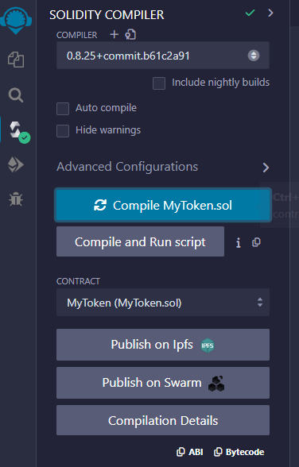
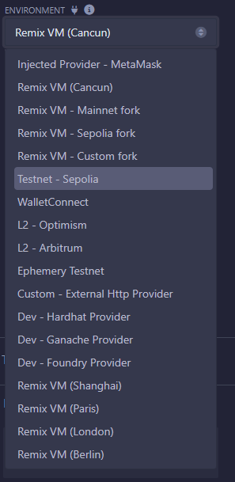
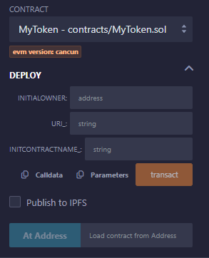
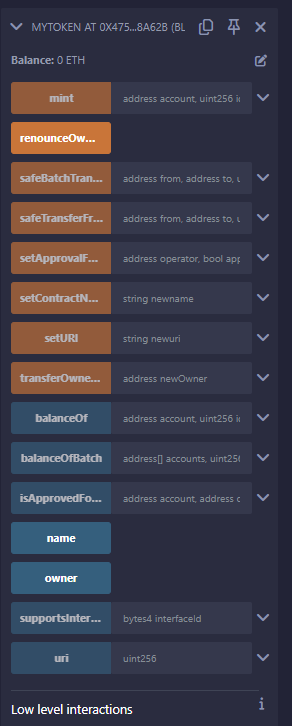

# ERC1155 Contract

`MyToken.sol` should be use on Remix with `@openzeppelin` library.

## How to run test the contract?

1. Go to [Remix Ethereum IDE](https://remix.ethereum.org/)
2. Select Templates: ERC1155 (OpenZeppelin).
3. Replace the `MyToken.sol` file created by the template with the code from this project.

## How to deploy and compile contract on Remix?

1. Refer to the [tutorial](https://remix-ide.readthedocs.io/en/latest/create_deploy.html).
2. First compile the contract
   
3. Choose Testnet Sepolia as the environment
   
4. You can deploy your new contract by filling the following fields, or load the previous deployed contract by filling the existing contract address at `At address` section.
   

※ You will need some SepoliaETH in order to deploy the contract. I personally recommend receiving the SepoliaETH via the [faucet](https://sepolia-faucet.pk910.de/). You'll need to follow the instruction on the site in order to start mining for SepoliaETH.

5. Test run the contract method
   

## Method Explanation

1. `setURI`: Sets the backend URL where the NFT Metadata is located. This ensures that if the backend address changes in the future, the data can still be found at another address and will not be lost.
2. `uri`: This is the method by which all NFT Metadata can be found. It will return the URL set by setURI in step 1. This method is automatically included in the OpenZeppelin library, so no need to implement it yourself.
3. `mint`: Mints an NFT. You must specify the wallet address of the owner, the quantity you want to create, and the token's ID. The token ID is very important, as it will be crucial for retrieving this NFT's content in the future.
